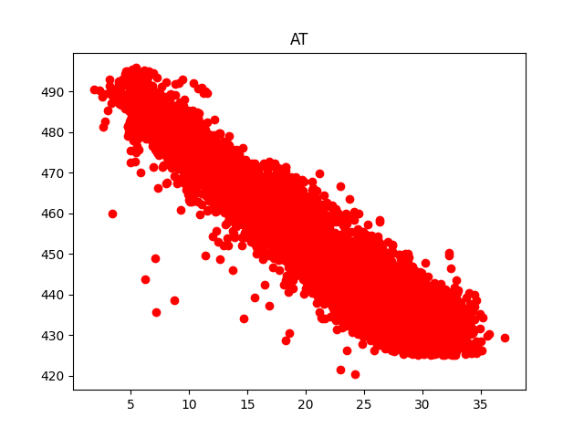
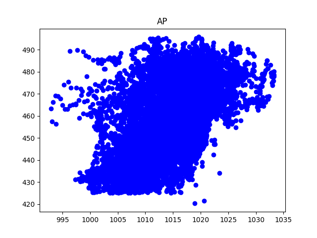
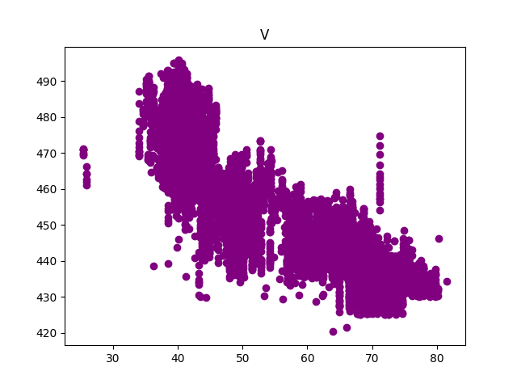
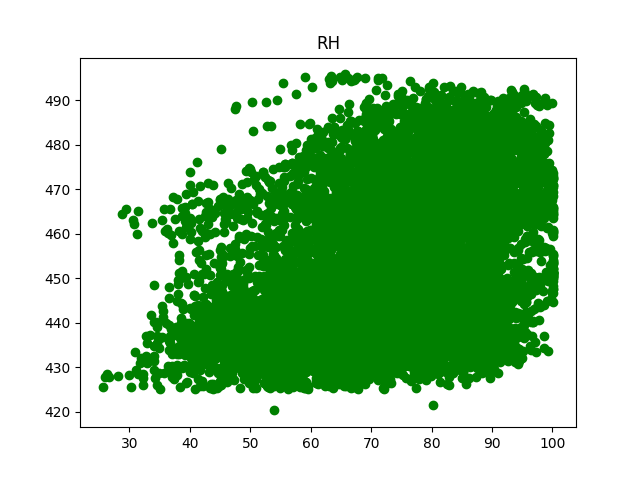

# This is a project I did for my Duke University class on Machine Learning.

I'm leaving out some of the specifics of teh class and focusing on the data itself. While anyone taking the class could use this information to copy what I did, not using all the information will make it harder to find. That said, I suspect ChatGPT would turn up most of this anyway so I'm not all that concerned about it.

## Reviewing the data.

We start with a CSV file that contains information in several columns. We are told that the first five colums (AT, AP, V, and RH) are features and the target column, which we intend to predict as our target is "PE".

First, I reviewed the data using the `matplotlib.pyplot` python library to make some plots of the data to see what we are dealing with:

### Plots

#### Column AT plotted against PE

#### Column AP plotted against PE

#### Column V plotted against PE

#### Column RH plotted against PE

Colunm AT shows a very strong corelation to PE. Column V also seems to show a strong corelation. To validate this visual inspection, I looked at how closely each feature was related mathematically.

### Feature Analysis

In the attemp1 file, I just looked at one column, AT, the one that looks the strongest. See [attempt1_linear_regression.py](./attempt1_linear_regression.py).
From this, I made sure that all the python libraries are working and that nothing weird is happening. I was sure that the CSV file is loading and that the information I'm pulling is coming out right.

In Attempt 2 [attempt2_linear_regression.py](./attempt2_linear_regression.py) we are looking at each feature and trying to see how useful it might be to predict PE. We get values for each of the features:

|Feature|Coef|MSE|R2|
|-------|----|---|--|
|AT |-2.17497502|30.24|0.90|
|V  |-1.16771064|68.55|0.76|
|AP |1.49231585|213.63|0.26|
|RH |0.44896125|239.57|0.17|

Next, I decided to look at performance of the variables in different combinations. Since the AP and RH column seem to ahve such little impact, I was curious about whether I needed to oncude them or not. It seems to me that including feautes that do not add value is a great way to end up with overfitting.

I moved on to Attempt 4 [Attempt 4](./attempt4_linear_regression.py) which I used to demonstrate that in the end, all four features were adding something to the prediction.

runFit(df[['AT']], df['PE'])
runFit(df[['V']], df['PE'])
runFit(df[['AT', 'V', 'RH']], df['PE'])
runFit(df[['AT', 'V', 'AP', 'RH']], df['PE'])

|Feature      | MSE                | Coef               | R2                 | MAPE               |
|-------------|--------------------|--------------------|--------------------|--------------------|
|AT           | 30.661447164469113 | 28.92833213148098  | 0.9002670702584261 | 0.9462638263715271 |
|V            | 68.52771780462527  | 69.97452255787228 	| 0.7587567748377073 | 1.4232587195837079 |
|AT, V, RH    | 21.92513663356294  | 20.38961245993731 	| 0.9297050456389121 | 0.7945207290561574 |
|AT, V, AP, RH| 21.887187590458108 | 20.301637786791286 | 0.9300083459417443 | 0.7933786123373698 |

